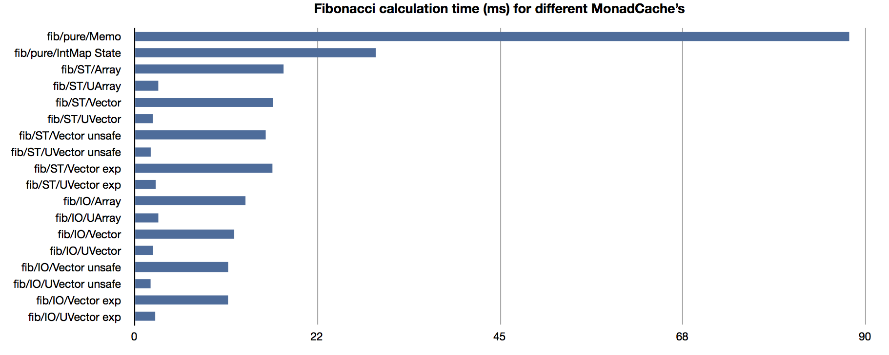

# monad-memo
[](https://github.com/EduardSergeev/monad-memo/actions?query=workflow%3Amaster+branch%3Amaster)
[](https://coveralls.io/github/EduardSergeev/monad-memo)
[](https://hackage.haskell.org/package/monad-memo)

## Purpose
This package provides a convenient mechanism for adding memoization to Haskell monadic functions.

## Memoization
Memoization is a well known way to speed up function evaluation by caching previously calculated results and reusing them whenever a memoized function is needed to be evaluated with the same arguments again.
It is usually associated with dynamic programming techiques. 

## Overview
Even though it is possible to manually add memoization to the code which would benefit from it, this ad-hoc approach has usual ad-hoc drawbacks: code pollution, bugs, resistance to changes.
This package however encapsulates the underlying plumbing behind its simple monadic interface `MonadMemo` with a single combinator `memo` which, when applied to monadic function, turns it into "memoized" one. 

The package offers various implementation of `MonadMemo` (which differs in terms of performance and requirements) and it is possible to choose/change the implementation without affecting the main function code.
The range of supported implementations "out of box" is limited by the range of containers provided by the standard packages installed by [Haskel Platform](http://www.haskell.org/platform/):
from default pure "fit them all" [Data.Map](http://hackage.haskell.org/packages/archive/containers/latest/doc/html/Data-Map.html) to very fast but limiting [vector](http://hackage.haskell.org/packages/archive/vector/latest/doc/html/Data-Vector-Generic-Mutable.html).
It is also possible to plug-in a custom container (from a third-party library) and run existing monadic code with it. 

The default implementation of `MonadMemo` is also [monad transformer](http://en.wikibooks.org/wiki/Haskell/Monad_transformers) so it can be "mixed" with other monads.
The package also provides the "memoized" versions of most standard monads found in [mtl](http://hackage.haskell.org/package/mtl). 

## Example of usage

A clasic example of function which greatelly benefits from memoization is a recursively defined Fibonacci number function.
A plain version of this function can be written in the following way:
```haskell
fib :: Integer -> Integer
fib 0 = 0
fib 1 = 1
fib n = fib (n-1) + fib (n-2)
```
which is very inefficient (impractical for `n>40`).

We can rewrite this definition as a monad:
```haskell
fibm :: Monad m => Integer -> m Integer
fibm 0 = return 0
fibm 1 = return 1
fibm n = do
  f1 <- fibm (n-1)
  f2 <- fibm (n-2)
  return (f1+f2)
```
and even run it with `Identity` monad with identical inefficiency:
```haskell
evalFibmId :: Integer -> Integer
evalFibmId = runIdentity . fibm
```

But all we need to do to make this function "computable" for reasonable argument is to add memoization for both recursive branches with `memo` combinator:
```haskell
fibm :: (MonadMemo Integer Integer m) => Integer -> m Integer
fibm 0 = return 0
fibm 1 = return 1
fibm n = do
  f1 <- memo fibm (n-1)
  f2 <- memo fibm (n-2)
  return (f1+f2)
```
then, to evaluate it with default `Data.Map` based memoization cache we use the following "eval*" function:
```haskell
evalFibm :: Integer -> Integer
evalFibm = startEvalMemo . fibm
```
Now the range of the arguments it can handle is limited only by `Integer` computation complexity and stack memory limit.

## More Examples

### Slightly more complicated recursive function
Well known [Ackerman function](http://en.wikipedia.org/wiki/Ackermann_function) is a two arguments function.
To memoize two argument function `for2` combinator can be used, giving the following generic code:

```haskell
ackm :: (Num n, Ord n, MonadMemo (n, n) n m) => n -> n -> m n
ackm 0 n = return (n+1)
ackm m 0 = for2 memo ackm (m-1) 1
ackm m n = do
  n1 <- for2 memo ackm m (n-1)    -- 'for2' adapts 'memo' for 2-argument 'ackm' 
  for2 memo ackm (m-1) n1

evalAckm :: (Num n, Ord n) => n -> n -> n
evalAckm n m = startEvalMemo $ ackm n m
```

### Mutually recursive function memoization
This example is taken from paper ["Monadic Memoization Mixins" by Daniel Brown and William R. Cook](http://www.cs.utexas.edu/~wcook/Drafts/2006/MemoMixins.pdf)

Given the following mutually recursive function definitions:

```haskell
-- 'f' depends on 'g'
f :: Int -> (Int,String)
f 0 = (1,"+")
f (n+1)	=(g(n,fst(f n)),"-" ++ snd(f n))

-- 'g' depends on 'f'
g :: (Int, Int) -> Int
g (0, m)  = m + 1
g (n+1,m) = fst(f n)-g(n,m)
```

How can we memoize both functions?

Lets try to just add [memo](http://hackage.haskell.org/packages/archive/monad-memo/latest/doc/html/Control-Monad-Memo.html#v:memo) for both functions:

```haskell
-- WRONG: Will NOT compile!
fm 0 = return (1,"+")
fm (n+1) = do
  fn <- memo fm n
  gn <- memo gm (n , fst fn)
  return (gn , "-" ++ snd fn)

gm (0,m) = return (m+1) 
gm (n+1,m) = do
  fn <- memo fm n
  gn <- memo gm (n,m)
  return $ fst fn - gn
```

GHC complains:

    "Occurs check: cannot construct the infinite type: t = (t, v)
         Expected type: t
   
         Inferred type: (t, v)"

which is understandable since we are trying to use the same cache for storing "key-value" pairs of the functions of different types (`fm :: Int -> m (Int,String)` and `gm :: (Int, Int) -> m Int`).
Obviously, to cache both function we will need _two_ caches (even if the types of the functions were identical, it's not very good idea to share the same cache).
And this is precisely what we have to do - use two memoization caches! The way to achieve it is to use _two_ [MemoT](http://hackage.haskell.org/packages/archive/monad-memo/latest/doc/html/Control-Monad-Memo.html#t:MemoT) monad transformers one nested in another:

```haskell
-- Memo-cache for 'fm'
type MemoF = MemoT Int (Int,String)
-- Memo-cache for 'gm'
type MemoG = MemoT (Int,Int) Int

-- | Combined stack of caches (transformers)
-- Stacks two 'MemoT' transformers in one monad to be used in both 'gm' and 'fm' monadic functions
type MemoFG = MemoF (MemoG Identity)
```

NB As usually with Haskell it isn't necessary to specify types here (or restrict them to [MemoT](http://hackage.haskell.org/packages/archive/monad-memo/latest/doc/html/Control-Monad-Memo.html#t:MemoT) combinations for the given example).

Then, a little bit of complication, since we use _two_ caches now (one from the current [monad transformer](http://en.wikibooks.org/wiki/Haskell/Monad_transformers) and another from the next, nested in the current) we need to use *memol_X_* set of functions: [memol0](http://hackage.haskell.org/packages/archive/monad-memo/latest/doc/html/Control-Monad-Memo.html#v:memol0), [memol1](http://hackage.haskell.org/packages/archive/monad-memo/latest/doc/html/Control-Monad-Memo.html#v:memol1) etc. Where _X_ specifies "sequential number" of the transformer in stack for a given cache (starting from the current). Here we use the current (0) and the next (1) for `fm` and `gm` respectively:

```haskell
fm :: Int -> MemoFG (Int,String)
fm 0 = return (1,"+")
fm (n+1) = do
  fn <- memol0 fm n
  gn <- memol1 gm (n , fst fn)
  return (gn , "-" ++ snd fn)

gm :: (Int,Int) -> MemoFG Int
gm (0,m) = return (m+1) 
gm (n+1,m) = do
  fn <- memol0 fm n
  gn <- memol1 gm (n,m)
  return $ fst fn - gn

evalAll = startEvalMemo . startEvalMemoT

-- | Function to run 'fm' computation
evalFm :: Int -> (Int, String)
evalFm = evalAll . fm

-- | Function to run 'gm' computation
evalGm :: (Int,Int) -> Int
evalGm = evalAll . gm
```

In fact we can also define 'gm' function in curried form:

```haskell
fm2 :: Int -> MemoFG (Int,String)
fm2 0 = return (1,"+")
fm2 n = do
  fn <- memol0 fm2 (n-1)
  gn <- for2 memol1 gm2 (n-1) (fst fn)
  return (gn , "-" ++ snd fn)

-- 2-argument function now
gm2 :: Int -> Int -> MemoFG Int
gm2 0 m = return (m+1) 
gm2 n m = do
  fn <- memol0 fm2 (n-1)
  gn <- for2 memol1 gm2 (n-1) m   -- 'for2' adapts 'memol1' for 2-argument gm2
  return $ fst fn - gn

evalFm2 :: Int -> (Int, String)
evalFm2 = evalAll . fm2
    
evalGm2 :: Int -> Int -> Int
evalGm2 n m = evalAll $ gm2 n m
```

### Combining MemoT with other monads
Being monad transformer, memoization monad can be combined with most of existing monads.
Here we mix it with [MonadWriter](http://hackage.haskell.org/packages/archive/mtl/latest/doc/html/Control-Monad-Writer-Class.html#t:MonadWriter):

```haskell
fibmw :: (Num n, MonadWriter String m, MonadMemo n n m) => n -> m n
fibmw 0 = tell "0" >> return 0
fibmw 1 = tell "1" >> return 1
fibmw n = do
  f1 <- memo fibmw (n-1)
  f2 <- memo fibmw (n-2)
  tell $ show n
  return (f1+f2)

-- To run combined monad we need to sequence both 'run' functions:
evalFibmw :: Integer -> (Integer, String)
evalFibmw = startEvalMemo . runWriterT . fibmw

res = evalFibmw 6  -- > produces (8,"1021310241021351021310246")
```

## Custom pure cache container
From monad-memo [version 0.3.0](http://hackage.haskell.org/package/monad-memo-0.3.0) it is possible to replace default [Data.Map](http://hackage.haskell.org/packages/archive/containers/latest/doc/html/Data-Map.html) with another (more efficient?) implementation of internal cache-container
as long as there is an instance of [Data.MapLike](http://hackage.haskell.org/packages/archive/monad-memo/0.3.0/doc/html/Data-MapLike.html) defined for this container.
The package currently defines these instances for [Data.Map](http://hackage.haskell.org/packages/archive/containers/latest/doc/html/Data-Map.html) and [Data.IntMap](http://hackage.haskell.org/packages/archive/containers/latest/doc/html/Data-IntMap.html) only.

For instance, should we decide to use [unordered-containers](http://hackage.haskell.org/package/unordered-containers) all we need to do is to define the following instance for our container:

```haskell
import Data.Hashable
import qualified Data.HashMap.Strict as H

instance (Eq k, Hashable k) => MapLike (H.HashMap k v) k v where
    lookup = H.lookup
    add = H.insert
```

then we just need to use `(``evalMemoState``H.empty)` instead of `startEvalMemo` and our memoized function will be evaluated using `Hashmap` as an internal container hosted in [MemoState](http://hackage.haskell.org/packages/archive/monad-memo/latest/doc/html/Control-Monad-Trans-Memo-State.html#t:MemoState).
There is usually no need to do any modification to the memoized function itself.

## Mutable arrays and vectors as MonadCache

### Array-based memoization cache
[version 0.4.0](http://hackage.haskell.org/package/monad-memo-0.4.0) adds [ArrayCache](http://hackage.haskell.org/packages/archive/monad-memo/0.4.0/doc/html/Control-Monad-Memo-Array.html): a new [MonadCache](http://hackage.haskell.org/packages/archive/monad-memo/0.4.0/doc/html/Control-Monad-Memo-Class.html#t:MonadCache) implementation based on mutable arrays (inside [IO](http://hackage.haskell.org/packages/archive/base/latest/doc/html/System-IO.html#t:IO) or [ST s](http://hackage.haskell.org/packages/archive/base/latest/doc/html/Control-Monad-ST.html) monad). The main benefit of this `MonadCache` is its performance: it can be an order of magnitude faser than standard `Data.Map`-based cache. This is due to the fact that arrays have `O(1)` lookup time and in-place mutable arrays also have `O(1)` for updates (i.e. the cache `add` operation).

Unfortunatelly you cannot always use this `MonadCache` due to array's natural limitations:

* The key must be an instance of [Ix](http://hackage.haskell.org/packages/archive/base/latest/doc/html/Data-Ix.html#t:Ix) typeclass   
* The bounds of the array must be known (and specified) beforehand and array cannot be resized
* Array is a continious space of values, so if the key distribution is wide and sparse the memory will be wasted (or array may not even fit into memory)

But if the nature of your memoized function permits the usage of `ArrayCache` you can make your code much more faster by simply switching from Map-based `MonadCache` to `ArrayCache` especially if the value type of your function can be "unboxed" (i.e. it is one of primitive types like `Int` or `Double`). "Unboxed" values are packed in unboxed arrays `UArray` which offer even faster execution and are the most efficient in terms of memory usage.
Normally you don't have to modify your monadic function definition to run `ArrayCache`-based memoization: just use appropriate `eval*` or `run*` function. For instance our canonical `fibm` function:

```haskell
fibm 0 = return 0
fibm 1 = return 1
fibm n = do
  n1 <- memo fibm (n-1)
  n2 <- memo fibm (n-2)
  return (n1+n2)
```

can be run using `ST` array of `Integers` with the following function:

```haskell
evalFibmSTA :: Integer -> Integer
evalFibmSTA n = runST $ evalArrayMemo (fibm n) (0,n)
```
here the `(0,n)` argument defines the bounds of cache array.
Is it equally easy to use unboxed version of the array, but `Integer` cannot be unboxed (it isn't primitive type), so lets just use `Double` for our function result:

```haskell
evalFibmSTUA :: Integer -> Double
evalFibmSTUA n = runST $ evalUArrayMemo (fibm n) (0,n)
```
 
Instead of `ST` you can use `IO` monad:

```haskell
evalFibmIOA :: Integer -> IO Integer
evalFibmIOA n = evalArrayMemo (fibm n) (0,n)

evalFibmIOUA :: Integer -> IO Double
evalFibmIOUA n = evalUArrayMemo (fibm n) (0,n)
```

### Vector-based memoization cache
For even better performance use [VectorCache](http://hackage.haskell.org/packages/archive/monad-memo/0.4.0/doc/html/Control-Monad-Memo-Vector.html) and its flavours ([unsafe version](http://hackage.haskell.org/packages/archive/monad-memo/0.4.0/doc/html/Control-Monad-Memo-Vector-Unsafe.html) and [dynamically expandable version](http://hackage.haskell.org/packages/archive/monad-memo/0.4.0/doc/html/Control-Monad-Memo-Vector-Expandable.html)) which are all based on very fast [vector](http://hackage.haskell.org/package/vector) library.

Note however that this `MonadCache` is even more limiting that `ArrayCache` since `vector` supports only `Int` as an index.

The usage is very similar to `ArrayCache`, but instead of range we need to specify the length of the vector:
```haskell
evalFibmSTV :: Int -> Integer
evalFibmSTV n = runST $ evalVectorMemo (fibm n) n

evalFibmIOUV :: Int -> IO Double
evalFibmIOUV n = evalUVectorMemo (fibm n) n
```
Use "Expandable" version to avoid specifying length parameter:
```haskell
import qualified Control.Monad.Memo.Vector.Expandable as VE

evalFibmSTVE :: Int -> Integer
evalFibmSTVE n = runST $ VE.startEvalVectorMemo (fibm n)
```

## Performance of different `MonadCache`'s:

The difference in performance for different `MonadCache`'s with Fibonacci function is demonstrated by [this criterion test](benchmark/Main.hs).
The test runs memoized Fibonacci function using the following caches:
 * default Map-based
 * State-based with Data.IntMap
 * array and unboxed array based (Array and UArray)
 * vector, unsafe vector and expandable vector (both boxed and unboxed vectors)



Full report can be [found here](http://htmlpreview.github.com/?https://github.com/EduardSergeev/monad-memo/blob/dev/benchmark/results/fib_memo.html).


## Custom mutable cache

It is also possible to use a mutable container as a `MonadCache` not defined here.
For example if we wish to use mutable hash-table from [hashtables package](http://hackage.haskell.org/package/hashtables) we can do so with the following code:
```haskell
{-# LANGUAGE MultiParamTypeClasses, TypeSynonymInstances, FlexibleInstances #-}

import Data.Hashable
import Control.Monad.ST
import Control.Monad.Memo
import Control.Monad.Trans.Memo.ReaderCache
import qualified Data.HashTable.ST.Basic as H

newtype Container s k v = Container { toTable :: H.HashTable s k v }

type Cache s k v = ReaderCache (Container s k v)

instance (Eq k, Hashable k) => MonadMemo k v (Cache s k v (ST s)) where
        {-# INLINE memo #-}
        memo f k = do
          c <- container
          e <- lift $ H.lookup (toTable c) k
          if isNothing e
            then do
              v <- f k
              lift $ H.insert (toTable c) k v
              return v
            else return (fromJust e) 

{-# INLINE fib1 #-}
fibm 0 = return 0
fibm 1 = return 1
fibm n = do
  f1 <- memo fibm (n-1)
  f2 <- memo fibm (n-2)
  return (f1+f2)

evalFib :: Int -> Int
evalFib n = runST $ do
   c <- H.new
   evalReaderCache (fibm n) (Container c)
```


## References
* http://www.haskell.org/haskellwiki/Memoization
* ["Monadic Memoization Mixins" by Daniel Brown and William R. Cook](http://www.cs.utexas.edu/~wcook/Drafts/2006/MemoMixins.pdf)
* [data-memocombinators](http://hackage.haskell.org/packages/archive/data-memocombinators/latest/doc/html/Data-MemoCombinators.html)
* ["Fun with Type Functions" by Oleg Kiselyov, Ken Shan, and Simon Peyton Jones (see 3.1 - "Type-directed memoization")](http://research.microsoft.com/~simonpj/papers/assoc-types/fun-with-type-funs/typefun.pdf)
